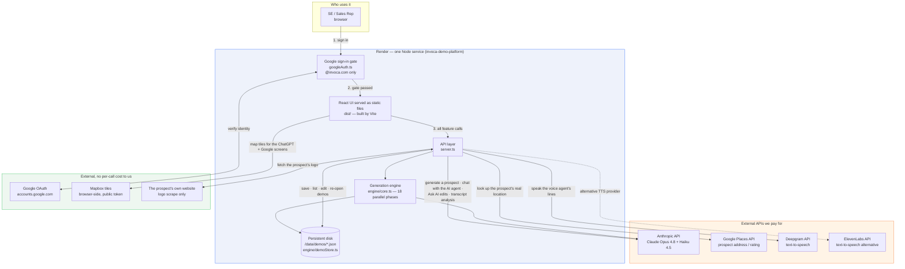

# Invoca Demo Generator — Architecture & Maintenance

**Live:** <https://invoca-demo-platform.onrender.com/> (sign-in required, `@invoca.com` only)
**Repo:** `github.com/ddesai-invoca/invoca-demo-platform` · deployed commit at time of writing: `e8b5fa8`

> **How to read this doc.** Sections 1, 2's walkthrough, and 6 are written for a
> non-technical audience. Sections 3–5 are for whoever maintains the tool. Every technical
> claim below was read out of the codebase; anything I could not confirm in code is marked
> **⚠️ NOT CONFIRMED IN CODE** rather than smoothed over. Three items in the original brief
> for this document fall into that category — see §6 and §7.

---

## 1. Overview

The Invoca Demo Generator turns a prospect's name and website into a complete, believable
walkthrough of the Invoca platform, re-skinned entirely to that prospect's business. An SE or
Sales Rep types "Roto-Rooter" and its URL, waits a few minutes, and gets a working set of
Invoca screens — dashboards, call transcripts, AI agent configuration, Signal management,
Insights reports — where every number, campaign name, product category, agent script, and
conversion label reads as though it came from that prospect's own Invoca account. It exists
because building a credible demo used to mean either showing a generic sandbox that looked
like nobody's business, or getting access to real customer data in the live platform. This
tool needs neither: it is a self-contained replica, so anyone on the team can produce a
prospect-specific demo in minutes without touching production Invoca and without waiting on
anyone else. As of this writing the shared library holds **58 saved demos** (source:
`GET /api/status`, field `demos`).

---

## 2. Technical Architecture



### Walkthrough for a non-technical reader

**There is one server, and it does three jobs.** It checks who you are, it serves the
website, and it is the only thing that talks to the paid AI services. Nothing sensitive ever
sits in the browser, which matters because the API keys we pay for live on that server and
nowhere else.

**Signing in.** The tool is not public. When you open the URL it hands you to Google to sign
in, and it only lets you through if your email ends in `@invoca.com`. Google charges nothing
for this.

**Generating a demo — this is where the money goes.** You give it a prospect name and
website. The server then makes roughly **20 separate requests to Anthropic's Claude API** for
that one prospect: one quick call to settle the prospect's core vocabulary (does this business
book "appointments", "consultations", "tours", "test drives"?), then **18 requests running in
parallel**, each writing one screen's worth of content — the marketing dashboard, the call
transcripts, the AI agent's script, the Signal library, and so on. It also makes **one call to
Google Places** to find the prospect's real address and rating, and fetches the prospect's own
website once to grab their logo. A finished prospect takes a few minutes and is then saved
permanently, so that cost is paid **once per prospect, not once per demo**. Re-opening a saved
demo later costs nothing.

**The features that cost money while you're demoing.** Three things call Anthropic live during
a demo: the AI agent you can text or talk to, the "Ask AI" panel that lets you re-word any
screen on the fly, and the transcript analyser. These use **Claude Haiku, the cheapest model**,
specifically because they run interactively. Separately, the voice agent's speech is generated
by **Deepgram**, which is the one integration that charges per second of audio produced.

**What this means for the spend.** The bill scales with how many *new prospects* the team
generates, not with how many demos they give. Ten SEs re-using the 58 demos already in the
library generate no new Anthropic cost at all. The expensive model (Claude Opus) is used only
during generation; everything interactive deliberately uses the cheap one.

---

## 3. Stack & Dependencies

All versions read from `package.json`.

### Runtime dependencies

| Package | Version | Purpose |
| --- | --- | --- |
| `react` / `react-dom` | ^19.2.7 | The UI. Every Invoca screen is a React component under `src/screens/`. |
| `react-router-dom` | ^7.18.1 | Client-side routing — the route table is `src/App.tsx`. |
| `@anthropic-ai/sdk` | ^0.111.0 | The only AI SDK. Used by `engine/core.ts`, `chat.ts`, `assistant.ts`, `analyze.ts`. |
| `express` | ^4.22.2 | The production server (`server.ts`) — serves `dist/` and every `/api/*` route. |
| `zod` | ^4.4.3 | Runtime validation of generated data against `src/data/schema.ts`. This is what stops a malformed AI response from reaching a screen. |
| `tsx` | ^4.23.1 | Runs the TypeScript server directly in production (`npm start`). |

### Build / dev tooling

| Package | Version | Purpose |
| --- | --- | --- |
| `vite` | ^8.1.1 | Dev server and production bundler. `vite.config.ts` also mounts dev-mode copies of the `/api/*` endpoints so local dev has parity with production. |
| `typescript` | ~6.0.2 | Two configs — `tsconfig.app.json` (browser) and `tsconfig.node.json` (server/engine). **Both must pass.** |
| `@vitejs/plugin-react` | ^6.0.3 | React fast refresh + JSX transform. |
| `oxlint` | ^1.71.0 | Linter (`npm run lint`). |
| Node | 22.x | Pinned in `package.json` → `engines`. |

### Third-party APIs — what is actually called

Verified by grepping for outbound `fetch` calls in `engine/` and `server.ts`.

| API | Called from | Cost model | Status |
| --- | --- | --- | --- |
| **Anthropic** — `claude-opus-4-8` | `engine/core.ts:23` | per token, highest tier | **Live.** Generation only. |
| **Anthropic** — `claude-haiku-4-5` | `core.ts:24`, `chat.ts:19`, `analyze.ts:12`, `assistant.ts:27` | per token, cheapest tier | **Live.** All interactive AI. |
| **Google Places** | `engine/places.ts:86` → `places.googleapis.com/v1/places:searchText` | per request | **Live.** One call per generation. |
| **Deepgram TTS** | `engine/tts.ts:47` → `api.deepgram.com/v1/speak` | per character/second | **Live** — see the note below. |
| **ElevenLabs TTS** | `engine/tts.ts:67` | per character | **Available, not selected.** Alternative provider; `TTS_PROVIDER` picks between them. |
| **Google OAuth** | `googleAuth.ts:101` → `oauth2.googleapis.com/token` | free | **Live.** |
| **Mapbox** | browser, via `src/data/prospectPlace.ts` (`VITE_MAPBOX_TOKEN`) | free tier | **Live.** The only key that is deliberately public — it is a browser-side map-tile token. |
| **The prospect's own website** | `engine/ogImage.ts:62` | free | **Live.** Fetches the homepage once to scrape a logo. |

> **⚠️ Two corrections to the brief for this document, both material:**
>
> **1. There is no ChatGPT/OpenAI integration, and no OpenAI spend.** A grep for `openai`,
> `api.openai.com`, `gpt-4`, and `chat.completions` across `src/`, `engine/`, `server.ts` and
> `package.json` returns nothing. The "ChatGPT tile" is `src/screens/ChatGptAd.tsx` — a
> pixel-replica of `chatgpt.com` rebuilt from a saved page capture, showing the prospect as a
> sponsored result. It is driven entirely by the local profile plus Mapbox tiles. Leadership
> should not be told we are paying OpenAI, because we are not.
>
> **2. Deepgram appears to be working, not blocked.** The live service reports
> `"ttsProvider":"deepgram","ttsKey":true` (`GET /api/status`), meaning a Deepgram key is set
> in the Render environment and the voice agent's speech path is wired end to end
> (`engine/tts.ts` → `POST /api/tts` → `src/components/VoiceCall.tsx`). If the voice agent is
> blocked, the blocker is **not** "no Deepgram key" — it is something outside this codebase
> (production/licensed access, or the AI Voice team's own agent rather than our TTS). Worth
> resolving before this is presented, since "blocked" and "already spending on Deepgram" are
> very different messages.

### Authentication — what it actually is

**⚠️ The brief calls this "SSO"; the code implements Google OAuth 2.0 with a domain
allowlist.** That is not the same thing as Okta/SAML SSO, and it is worth stating precisely to
a security-minded audience.

From `googleAuth.ts`: a standard OAuth 2.0 authorization-code flow written against Node's
built-in `crypto` and `fetch` with **no extra dependencies**. It requests scope
`openid email profile`, verifies a CSRF `state` cookie, and on success sets a signed
`HttpOnly` session cookie. Access is granted only if the email's domain matches
`ALLOWED_EMAIL_DOMAIN` (default `invoca.com`). The gate turns on **only when both**
`GOOGLE_CLIENT_ID` and `GOOGLE_CLIENT_SECRET` are set — so a misconfigured deploy fails open,
not closed (see §7).

`/healthz`, `/api/status` and `/api/canary` are registered **before** the gate and are
therefore public by design — they return counts, booleans and timings only, never prospect
names, demo IDs, emails, or key values (`server.ts:62–88`).

---

## 4. Core Flows

### 4.1 Generating a new prospect

**Entry point:** the Launch screen (`src/screens/Launch.tsx`) — name + website URL.

1. **Browser** — `Launch.tsx:310` posts `{ name, url }` to `POST /api/generate`.
2. **Server** — `server.ts:109` receives it, requires `ANTHROPIC_API_KEY`, and calls
   `generateProfile()` (`engine/core.ts:994`).
3. **Vocabulary first** — `generateTerms()` (`core.ts:339`) makes one fast Haiku call to fix
   the prospect's canonical terms: `bookingTerm` ("Consultation" / "Tour" / "Test Drive"),
   `customerNoun` ("Patient" / "Member" / "Guest"), plus the qualified-call and conversion
   terms. Everything downstream reuses these, which is what stops one screen saying
   "Appointment" while another says "Consultation".
4. **Numbers second** — `buildScale()` / `scaleRules()` pin every canonical figure *before*
   any content is generated, so the 18 parallel phases cannot disagree about call volume or
   revenue.
5. **18 phases in parallel** — `runPool(tasks, CONCURRENCY = 6)` (`core.ts:220`, invoked at
   `core.ts:1056`) runs the phases longest-processing-time-first so a heavy phase never starts
   late. The phases are: `dashboardChannels`, `dashboardSegments`, `opsDashboard`,
   `callReview`, `agentConfig`, `signalManager`, `dashboard`, `digitalInsights`,
   `conversationIntelligence`, `callDetail`, `aiAgentConversion`,
   `voiceConversationIntelligence`, `smsConversationIntelligence`, `aiMessagingImpact`,
   `voiceRoutingDemo`, `screenpops`, and two more.
6. **Enrichment** — `engine/places.ts` fetches the real business location; `engine/ogImage.ts`
   scrapes the logo.
7. **Validation** — the assembled object is parsed against the Zod schema in
   `src/data/schema.ts`. A malformed phase fails here rather than on screen.
8. **Persistence** — written to `src/data/generated/<slug>.json` (`server.ts:128`) and, via
   the demo library, to the Render disk.

**Cost note:** ~20 Anthropic calls per prospect, once. Steps 3–5 are the entire AI spend of a
generation.

### 4.2 The bundled examples ("Example" dropdown)

Ten seed prospects ship in the repo at `src/data/generated/*.json` and load with zero API
calls: `autonation`, `continuing-life`, `goosehead-insurance`, `key-whitman-eye-center`,
`mattress-firm`, `national-van-lines`, `orlando-health`,
`roto-rooter-plumbing-and-water-cleanup`, `surfside-healthcare`, `vector-security`. An
eleventh, **Shady Blinds**, is hand-authored as TypeScript (`src/data/profiles/shadyBlinds.ts`)
and is the reference implementation — when a screen is built, it is built against Shady Blinds
first.

`Launch.tsx:155` distinguishes **SAMPLES** (bundled seeds, owned by nobody) from demos in the
shared library (owned by their creator). The active prospect is held in
`src/data/ProfileContext.tsx` and mirrored to `localStorage` under `invoca-demo:activeId`.

Vector Security is a good illustration of per-prospect tuning: commits `2773cec` and `d083a30`
renamed its Google Ads keyword to a search-like phrase and its Digital Insights signal to
"Quote Discussed", because an alarm company quotes rather than books.

### 4.3 Editing, saving, and re-opening a demo

**The shared library** lives in `engine/demoApi.ts` and `engine/demoStore.ts`:

| Route | Method | Behaviour |
| --- | --- | --- |
| `/api/me` | GET | the signed-in user, and whether they are an admin |
| `/api/demos` | GET | summaries only, no heavy payload |
| `/api/demos` | POST | create; the caller becomes the creator |
| `/api/demos/:id` | GET | the full demo |
| `/api/demos/:id` | PATCH | update customizations — **owner or admin only** |
| `/api/demos/:id/duplicate` | POST | copy as mine |

Writes go through a single `canWrite()` check (`demoApi.ts:65`) so PATCH and DELETE can never
diverge in who they let through. The frontend lock is convenience only; the server enforces it.

**Storage** — one JSON file per demo at `DATA_DIR/demos/<id>.json`, written atomically
(temp file then rename, `demoStore.ts:88`). `DATA_DIR` resolves `$DATA_DIR` → `/data` (the
mounted Render disk) → a local fallback (`demoStore.ts:24–40`). The live service confirms
`storage.persistent: true`.

**In-demo editing ("Ask AI")** — the sparkle in the top bar opens a drawer that edits the
current screen's data via `POST /api/ai-assistant` (`server.ts:154` → `engine/assistant.ts`).
Edits are keyed `${profileId}::${pathname}` in `src/data/AiAssistantContext.tsx`, so an edit
made on one screen cannot leak to another. `src/data/editGuard.ts` rejects structural changes
(adding/removing fields) while allowing content changes, and `engine/demoPatches.ts` applies
the result. Re-opening the demo later replays those saved customizations over the base profile.

### 4.4 Live AI during a demo

| Feature | Endpoint | Engine module | Model |
| --- | --- | --- | --- |
| SMS / voice agent conversation | `POST /api/chat` | `engine/chat.ts` | Haiku 4.5 |
| Ask AI screen edits | `POST /api/ai-assistant` | `engine/assistant.ts` | Haiku 4.5 |
| Transcript signal analysis | `POST /api/analyze` | `engine/analyze.ts` | Haiku 4.5 |
| Voice agent speech | `POST /api/tts` | `engine/tts.ts` | Deepgram (or ElevenLabs) |

---

## 5. Maintenance Guide

*Written for a second SE joining to help maintain this.*

### Local setup

```bash
git clone git@github.com:ddesai-invoca/invoca-demo-platform.git
cd invoca-demo-platform
npm install
# create .env (see below) — at minimum ANTHROPIC_API_KEY
npm run dev            # http://localhost:5173 — Vite serves the UI AND dev /api/* routes
```

`vite.config.ts` mounts dev-mode copies of `/api/generate`, `/api/delete-profile`,
`/api/chat`, `/api/place` and the demo library so local dev behaves like production. To test
the **production** server path instead: `npm run serve` (builds, then runs `server.ts`).

### Environment variables

Server-side only. **Never prefix a secret with `VITE_`** — that prefix puts the value into the
browser bundle. `VITE_MAPBOX_TOKEN` is the sole intentional exception (a public map token).

| Variable | Required? | Purpose |
| --- | --- | --- |
| `ANTHROPIC_API_KEY` | **Yes** | All AI: generation, chat, Ask AI, analyze |
| `GOOGLE_CLIENT_ID` + `GOOGLE_CLIENT_SECRET` | For the sign-in gate | Both must be set or the gate is off |
| `SESSION_SECRET` | With the gate | Signs the session cookie |
| `BASE_URL` | With the gate | Builds the OAuth redirect (`<BASE_URL>/auth/callback`) |
| `ALLOWED_EMAIL_DOMAIN` | No | Defaults to `invoca.com` |
| `GOOGLE_PLACES_API_KEY` | For location enrichment | **Secret — no `VITE_` prefix** |
| `DEEPGRAM_API_KEY` / `ELEVENLABS_API_KEY` | For voice | Pick with `TTS_PROVIDER` |
| `DEEPGRAM_MODEL` / `ELEVENLABS_VOICE_ID` / `ELEVENLABS_MODEL_ID` | No | Voice tuning |
| `VITE_MAPBOX_TOKEN` | For the map screens | Public by design |
| `DEMO_ADMIN_EMAILS` | No | Who may edit any demo |
| `DATA_DIR` | No | Overrides the demo-storage path |
| `CANARY` / `CANARY_HOUR_ET` / `CANARY_ON_BOOT` | No | Nightly self-check (see below) |

`.env` is git-ignored. Confirm before every commit that it has not been staged.

### Deploying

Render auto-deploys on push to `main`. There is **no** `render.yaml` in the repo — the service
is configured in Render's dashboard (**inferred from the absence of the file plus the
`RENDER_*` env vars read in `engine/status.ts`; verify in the Render UI**).

```bash
npm run build                                    # must pass
./node_modules/.bin/tsc --noEmit -p tsconfig.app.json    # both configs must pass
./node_modules/.bin/tsc --noEmit -p tsconfig.node.json
git push origin main                             # triggers the deploy
```

**Confirm the deploy landed by checking the commit SHA, not just that the site responds:**

```bash
curl -s https://invoca-demo-platform.onrender.com/api/status
```

The old instance keeps answering `200` during a rollout, so an HTTP-status check will
cheerfully report success while the previous build is still live. Compare `commitShort`
against what you pushed.

### Adding a new screen or vertical

- **A new screen:** ask which live Invoca URL to replicate, save a SingleFile capture of it,
  then build from measured values. Screens live in `src/screens/`, styles in
  `src/styles/app.css` under a per-screen class prefix.
- **A new vertical:** nothing to add. Generation is prompt-driven and vertical-agnostic — the
  `reskin()` directive in `engine/core.ts` re-skins every label from the prospect's brief. A
  vertical needs code only when it requires a *screen* that does not exist yet.
- **The rule that matters most:** a change for one screen must not alter any other. Shared
  components take opt-in props defaulted to current behaviour, CSS is scoped per screen, and
  you verify by loading another screen and asserting the old values. This is documented at
  length in `CLAUDE.md` under *Conventions*.

### Common failure points

1. **`tsc` or `tsx` "not found"** — you are in the wrong directory. Always
   `cd /path/to/invoca-demo-platform` first.
2. **Editing an engine prompt has no effect** — engine modules are dynamically imported and
   Node-cached. **Restart the dev server.** (The CLI is a fresh process and does not need it.)
3. **Both typecheck configs** — a change can pass `tsconfig.app.json` and break
   `tsconfig.node.json`. Run both.
4. **Deploy verification** — see above; check the SHA.
5. **Generated data drift** — `signalsMet` / `signalsUnmet` / `signalsNa` in generated
   profiles are written as fixed numbers (26 and 25 on every prospect) that do not match the
   accompanying name arrays. A fix is in flight; see §7.
6. **Nightly canary** — `engine/canary.ts` generates a throwaway prospect at ~5am ET,
   checks it against a time budget and a set of data-quality rules, deletes it, and exposes the
   result at the public `GET /api/canary`. If generation silently breaks, this is what catches
   it. `missing`/`stale` flags mean *no result*, which is deliberately **not** reported as
   healthy.

---

## 6. Roadmap / Status

| Feature | Status | Notes |
| --- | --- | --- |
| Core generation engine (18 parallel phases) | **Shipped** | `engine/core.ts`. ~2m45s per prospect; the floor is the concurrency pool, not any one phase. |
| Six platform dashboards | **Shipped** | Marketing Performance, Marketing & Ops, AI Agent Conversion, AI Messaging Impact, QM Actionable, QM Instant. |
| Shared team demo library (58 demos live) | **Shipped** | `engine/demoApi.ts` + a persistent Render disk. |
| Google sign-in gate, `@invoca.com` only | **Shipped** | `googleAuth.ts`. |
| "Ask AI" per-screen editing + undo | **Shipped** | Every screen; edits scoped per screen. |
| SMS / voice Preview Agent | **Shipped** | `POST /api/chat`. |
| ChatGPT + Google Ads paid-placement screens | **Shipped** | Replicas, no third-party API. |
| Location Performance Comparison dashboard | **Shipped** | Aug 5 (`09c8c9c`). |
| Nightly generation self-check (canary) | **Shipped** | 5am ET; public status endpoint. |
| **Insights / Reporting 2.0 tab** | **Shipped — Aug 6** | Three reports (Summary Dashboard, Details Report, Connect AI), a call-detail page, interactive charts with drill-through. Commit `e8b5fa8`. *The brief listed this as In Progress; it shipped.* |
| **Signal tab rebuild** | **In progress — not yet deployed** | Flyout nav, source type-select, Semantic Signal Library, template drawer, Edit Rule Signal. Working locally; **uncommitted**, so not on the live service. |
| Signal AI Studio / Rule-based Signal builders | **Not started** | The type-select links exist; both return to Manage Signals. |
| Voice agent | **⚠️ Status disputed** | The brief says *blocked pending Deepgram access from the AI Voice team*, but the live service reports a working Deepgram key and the TTS path is wired end to end. Resolve before presenting. |
| Video enablement | **⚠️ NOT CONFIRMED IN CODE** | The brief lists this as shipped Aug 5. No commit, file, or dependency in this repo relates to video. If it means a recorded walkthrough *about* the tool, it is not a code feature and should be described separately. |
| Engine fix: hardcoded signal counts | **In progress** | Spun out as its own task; see §7. |

> **Two dates in the brief I could not corroborate.** Commit history has nothing for **Aug 7**
> — the most recent commit is Aug 6 (`e8b5fa8`) — so "Signal Gold AI vertical shipped Aug 7"
> has no code behind it; the Signal work is real but uncommitted. And no Aug 5 commit relates
> to video. Both are flagged rather than repeated, because this document is going to leadership.

---

## 7. Open Questions / Risks

**1. The sign-in gate fails open.** From `DEPLOY.md` and `googleAuth.ts`: the gate is active
only when *both* `GOOGLE_CLIENT_ID` and `GOOGLE_CLIENT_SECRET` are present. If either is
cleared or mistyped in Render, the app keeps serving — **unauthenticated, to the public
internet**, with the whole demo library readable. It currently reports `authGate: true`, so
this is a latent misconfiguration risk, not a present exposure. Worth changing to fail closed.

**2. The Signal rebuild is uncommitted.** Five screens' worth of work (four new screens plus a
nav change and a 158KB image asset) exists only in the working tree. An accidental
`git checkout` loses it. It should be committed even if not pushed.

**3. Generated profiles carry a known data inconsistency.** Every engine-generated prospect
writes `signalsUnmet: 26` and `signalsNa: 25` while listing only 5–15 signal names. The badge
therefore contradicts the list it expands, and the identical 26/25 across all ten profiles is
itself a giveaway. The new Insights call page works around it by counting the list; the older
`src/screens/CallDetail.tsx` still shows the declared number. The engine fix is a separate task
in flight. **The 58 demos already saved on the live service keep the bad values until they are
regenerated.**

**4. Phrase data in the Semantic Signal Library is uneven, and the file says so.** Only one
template drawer was open in the source capture, so `Ask for Appointment` has all 44 real
phrases, two more have partial lists from screenshots, and **the other 12 templates' phrases
were authored by me, not captured**. Each entry carries a `captured: true/false` flag
(`src/data/semanticSignals.ts`). Low risk — they are generic conversational phrases, not
customer data — but nobody should present them as Invoca's official library content.

**5. Four sample prospects violate a data rule we otherwise enforce.** The "volume is not
value" story (the highest-volume row must show the *worst* conversion rate) is enforced in
prompts and checked by the canary, but `continuing-life`, `key-whitman-eye-center`,
`orlando-health` and `mattress-firm` were generated before the fix and still read inverted.
They need regenerating.

**6. The generation floor is structural.** ~2m45s per prospect is set by
`CONCURRENCY = 6` against 18 phases, not by any single slow call. Making it materially faster
means raising concurrency (more simultaneous Anthropic requests, i.e. rate-limit exposure) or
cutting phases. Worth knowing before anyone promises "instant".

**7. Single point of failure on one person's knowledge.** The conventions that keep this
maintainable — measure from captures, derive rather than invent, one screen's change stays in
its screen — are written down in `CLAUDE.md`, but the tool has had one author. The onboarding
in §5 is the mitigation; a second maintainer actually shipping a screen is the test of it.

**8. Deployment configuration lives only in Render's dashboard.** With no `render.yaml` in the
repo, the service definition is not version-controlled and cannot be recreated from the code
alone. **(Inferred from the file's absence — verify in the Render UI.)**

**9. Demo storage is a mounted disk, not a database.** One JSON file per demo on Render's
persistent disk. Writes are atomic and it reports `persistent: true`, but there is no evidence
in the repo of a **backup** of that disk. If it were lost, all 58 saved demos go with it. Ten
bundled samples live in git and would survive; nothing else would.
